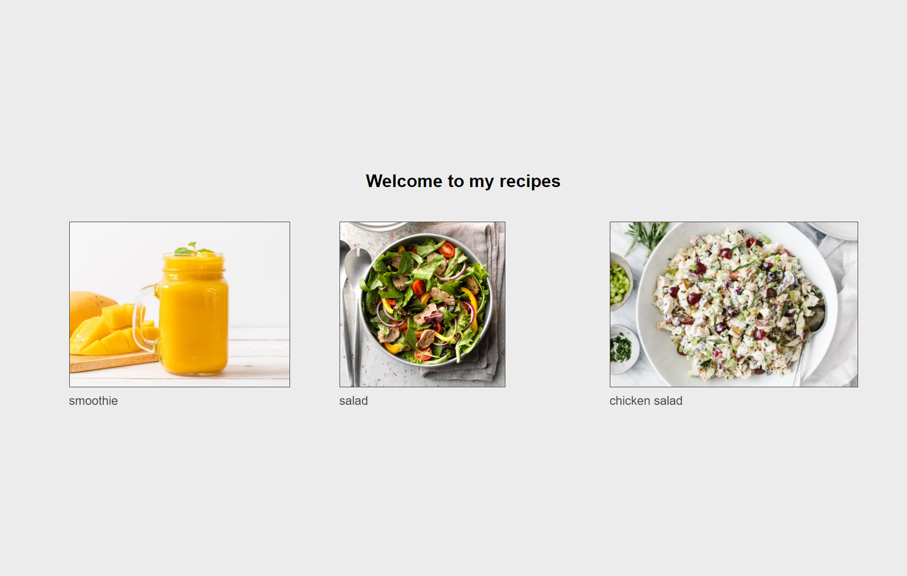

## Recipe app

  

## Getting Started

```bash
npm run dev
```
If you run `npm run start` it will not refresh as you code.


Open [http://localhost:3000](http://localhost:3000) with your browser to see the result.

## Sanity Studio
I had to run `npx sanity install` in [cms recipe folder](./recipe), otherwise when I was trying to run `npm run start` in that folder it would throw a `Error: No "sanity.json" file found in plugin "@sanity/base"` exception.

This is a CMS for this project.
goto [cms recipe folder](./recipe) folder and run `npm run start`  
